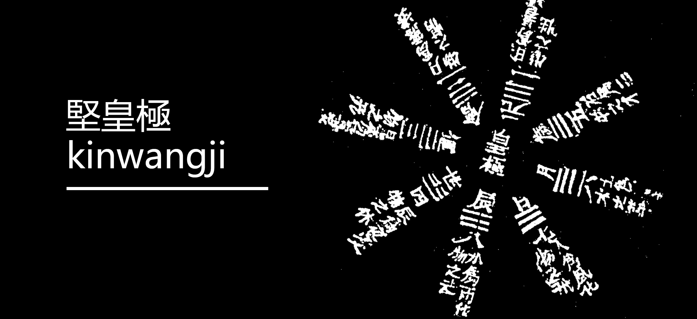

<div align="center">

# ☯ 堅皇極經世 KinWangJi

### 皇極經世 Python 開源實現 ｜ Open-Source Python for Huangji Jingshi

[](https://www.python.org/downloads/)
[](https://opensource.org/licenses/MIT)
[](https://github.com/kentang2017/kinwangji/stargazers)
[](https://github.com/kentang2017/kinwangji/network/members)
[](https://github.com/kentang2017/kinwangji/issues)

**用 Python 探索千年易學智慧 ｜ Explore millennium-old I Ching wisdom with Python**

[中文介紹](#-簡介) · [English](#-introduction) · [安裝 Install](#-安裝-installation) · [使用 Usage](#-使用方式-usage) · [贊助 Donate](#-贊助-donate--sponsor)



</div>

---

## 📖 簡介

**堅皇極經世** 是北宋大儒邵雍（1011–1077）所創《皇極經世》的 Python 開源實現。

邵雍，字堯夫，號康節，北宋五子之一，以先天易學與象數哲學聞名於世。他窮三十年心力觀天地之消長，建構出恢宏的宇宙時間大數：

> **一元 = 129,600 年**（12會 × 30運 × 12世 × 30年）

元會運世，週而復始，推演古今治亂興亡——這不僅是中國古代最精密的時間哲學體系之一，更是易學象數派的巔峰之作。

本專案以現代 Python 重現核心算法，並提供 **Streamlit 互動網頁應用**，輸入任意日期即可觀察「皇極」視角下的時空定位與卦象排盤。

## 📖 Introduction

**KinWangJi** is an open-source Python implementation of **Huangji Jingshi** (皇極經世, *Book of Supreme World Ordering Principles*) — the magnum opus of Shao Yong (邵雍, 1011–1077), one of the greatest Neo-Confucian philosophers of the Northern Song dynasty.

Shao Yong devoted 30 years to observing the rise and fall of heaven and earth, constructing a grand cosmic time framework:

> **1 Yuán (元) = 129,600 years** (12 Huì × 30 Yùn × 12 Shì × 30 years)

These nested cycles — Yuán (元), Huì (會), Yùn (運), Shì (世) — model the cosmic rhythm of order and change across millennia. Huangji Jingshi stands as one of the most sophisticated temporal-philosophical systems in classical Chinese thought.

This project brings the core algorithms to life with modern Python and provides an interactive **Streamlit web app** where you can input any date to see its cosmic position and hexagram divination.

---

## ✨ 主要功能 Features

| 功能 Feature | 說明 Description |
|---|---|
| 🔢 **元會運世** Yuan-Hui-Yun-Shi | 宇宙大數時間框架換算 — Cosmic cycle time-frame conversion |
| 📅 **二十四節氣** 24 Solar Terms | 天文曆法精確節氣計算 — Astronomically precise solar term calculation |
| 🔮 **卦象排盤** Hexagram Divination | 皇極經世大數週期定位（年→世→運→會→元） — Map any date to I Ching hexagrams |
| 🎵 **聲音律呂** Tonal System | 聲音律呂基礎對應 — Fundamental tone-pitch correspondences *(expanding)* |
| 🌐 **互動應用** Web App | Streamlit 互動網頁（選擇日期 → 顯示卦象與時空坐標） — Interactive date-to-hexagram web UI |
| 📜 **歷史年卦** Historical Hexagram | 隨機歷史年份對應卦象與朝代資訊 — Random historical year hexagram & dynasty info |

---

## 🚀 安裝 Installation

需要 Python 3.8 以上。 ｜ Requires Python 3.8+.

```bash
# 從 PyPI 安裝 / Install from PyPI
pip install kinwangji

# 或從 GitHub 安裝 / Or install from GitHub
pip install git+https://github.com/kentang2017/kinwangji.git

# 本地開發安裝（可編輯模式）/ Local editable install
git clone https://github.com/kentang2017/kinwangji.git
cd kinwangji
pip install -e .

# 包含 Streamlit 應用依賴 / With Streamlit app dependencies
pip install -e ".[app]"
```

---

## 💡 使用方式 Usage

```python
from kinwangji import wanji_four_gua, display_pan, jq

# 取得某日的皇極經世卦象 / Get Huangji hexagrams for a date
result = wanji_four_gua(2025, 6, 15, 10, 30)
print(result)

# 取得節氣 / Get the solar term
solar_term = jq(2025, 6, 15, 10, 30)
print(solar_term)

# 顯示完整排盤 / Display the full divination board
print(display_pan(2025, 6, 15, 10, 30))
```

### 🌐 Streamlit 互動應用 Interactive Web App

```bash
pip install -e ".[app]"
streamlit run app.py
```

啟動後在瀏覽器中選擇日期和時間，即可查看卦象排盤。支援中英文切換。

Launch the app, pick a date/time in the browser, and explore your hexagram divination. Supports Chinese/English toggle.

---

## 🗂️ 專案結構 Project Structure

```
kinwangji/
├── kinwangji/          # 主要套件 / Core package
│   ├── __init__.py
│   ├── jieqi.py        # 節氣計算 / Solar term calculation
│   ├── wanji.py        # 皇極經世核心算法 / Huangji Jingshi core algorithms
│   ├── history.py      # 歷史年卦資料 / Historical year hexagram data
│   └── data/
│       └── data.pkl    # 卦象資料 / Hexagram data
├── examples/           # 使用範例 / Usage examples
├── tests/              # 測試 / Tests
├── app.py              # Streamlit 應用 / Streamlit web app
├── pyproject.toml      # 專案配置 / Project config
└── README.md
```

---

## 🤝 貢獻 Contributing

歡迎提交 Issue 和 Pull Request！無論是修復 bug、改進文件、還是新增功能，我們都非常感謝。

Contributions are welcome! Whether it's bug fixes, documentation improvements, or new features — feel free to open an issue or submit a pull request.

```bash
# 開發環境設置 / Dev setup
git clone https://github.com/kentang2017/kinwangji.git
cd kinwangji
pip install -e ".[app,dev]"
python -m pytest tests/ -v
```

---

## 💖 贊助 Donate / Sponsor

如果這個專案對你有幫助，歡迎請作者喝杯咖啡 ☕，您的支持是持續開發的動力！

If this project is helpful to you, consider buying the author a coffee ☕ — your support fuels continued development!

<div align="center">

**PayPal:** [paypal.me/kentang2017](https://paypal.me/kentang2017)

如果暫時無法贊助，也歡迎給一顆 ⭐ **Star** 支持一下！

Can't donate right now? A ⭐ **Star** on this repo is just as appreciated!

[](https://github.com/kentang2017/kinwangji)

</div>

---

## 📄 授權 License

本專案採用 [MIT License](https://opensource.org/licenses/MIT) 開源授權。

This project is licensed under the [MIT License](https://opensource.org/licenses/MIT).
